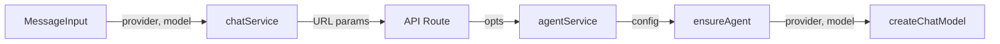
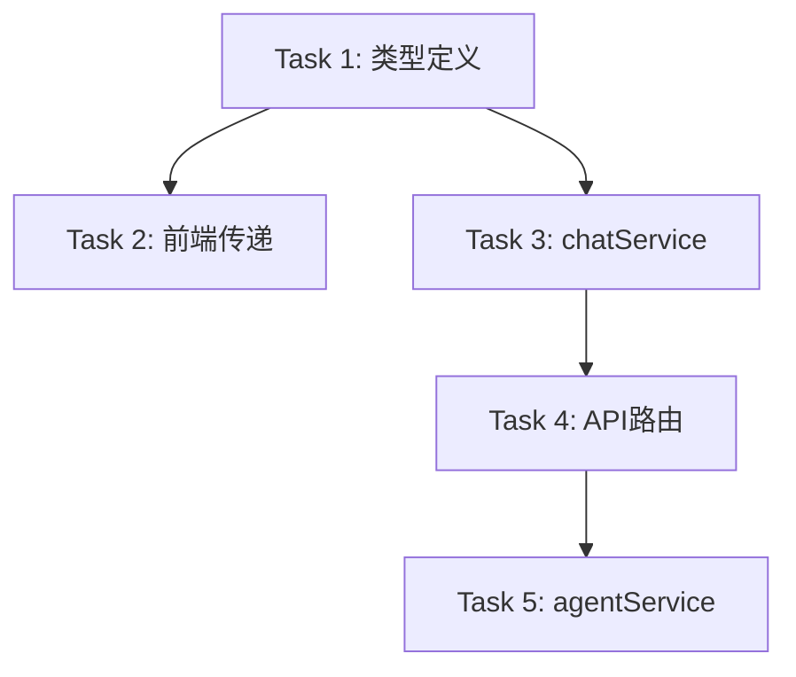

# TASK: DeepSeek Provider 修复

## 架构设计

## 子任务列表

### Task 1: 类型定义更新
- **文件**: `src/types/message.ts`
- **修改**: `MessageOptions` 添加 `provider?: string`
- **验收**: TypeScript 类型检查通过

### Task 2: 前端参数传递
- **文件**: `src/components/MessageInput.tsx`
- **修改**: `handleSubmit` 中 `onSendMessage` 调用添加 `provider`
- **验收**: 发送消息时 opts 包含 provider

### Task 3: chatService URL 参数
- **文件**: `src/services/chatService.ts`
- **修改**: `createMessageStream` 添加 provider 到 URL params
- **验收**: EventSource URL 包含 provider 参数

### Task 4: API 路由解析
- **文件**: `src/app/api/agent/stream/route.ts`
- **修改**: 从 searchParams 读取 provider，传递给 streamResponse
- **验收**: opts 包含 provider

### Task 5: agentService 传递
- **文件**: `src/services/agentService.ts`
- **修改**: ensureAgent 调用添加 provider 参数
- **验收**: createChatModel 收到正确的 provider

## 任务依赖图

## 执行检查清单

- [x] 完整性：5个任务覆盖完整数据流
- [x] 一致性：与现有架构模式一致
- [x] 可行性：简单参数传递，技术可行
- [x] 可控性：每个任务独立可验证
- [x] 可测性：可通过发送消息验证
